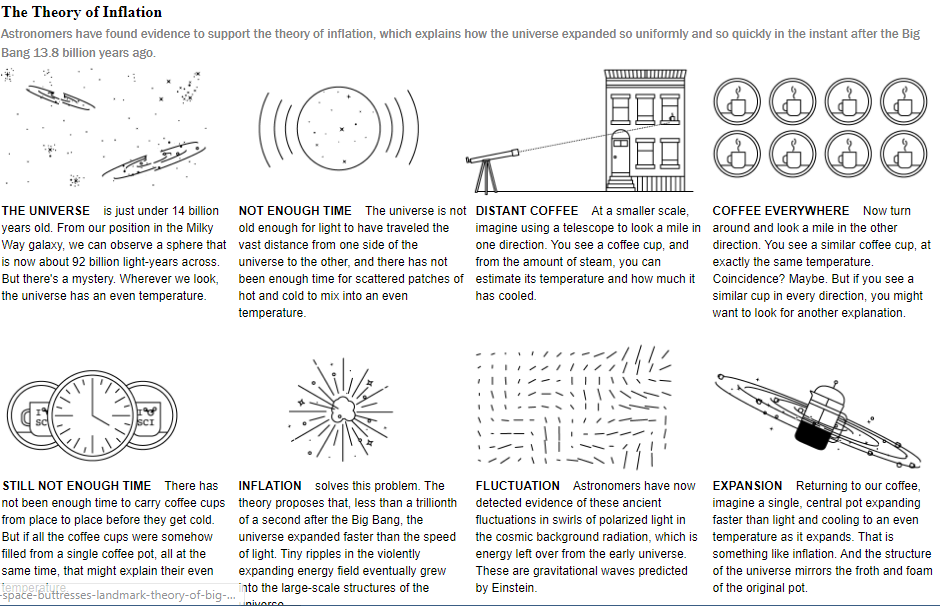
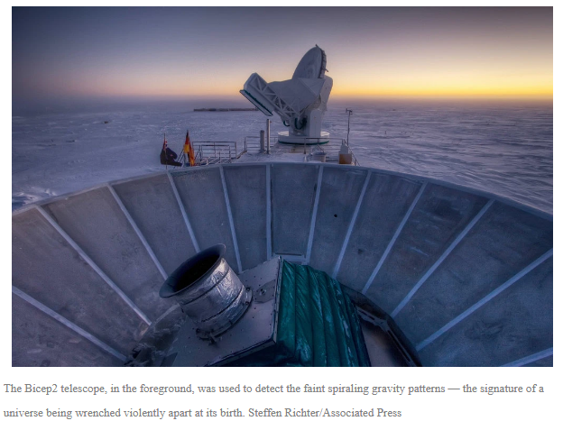
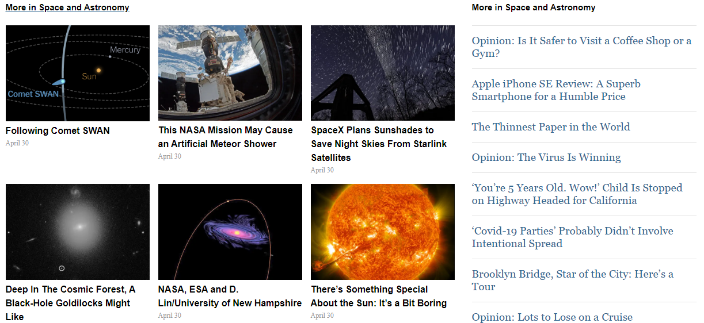
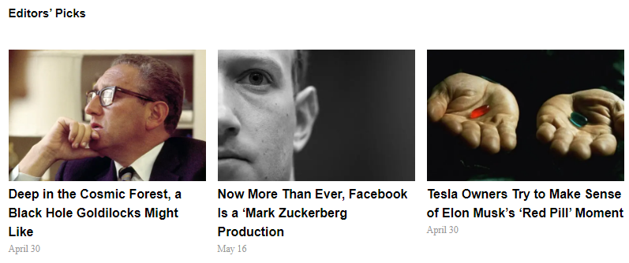

# New York Times - Clone

This is a clone application of New York Times.
 
 
 
 
 

 

In this project, we aimed at producing a close replica of the New York Times news page, while focusing on how to use positioning elements in CSS. That means two things – laying out the basic structure of the page using semantic HTML elements and ensuring that the elements are properly sized and positioned.

## Built with
  * HTML 
  * CSS (Box Model, Float, Grid, Flex and Positioning)
  * Lint (Stickler)
  * W3C Validator

## Live demo
https://rawcdn.githack.com/Guy-Gustave/POSITIONING-AND-FLOATING-ELEMENTS/tree/feature

## Getting started
**For this project, we tried our best to recreate the New York Times web page. The main aim is to ensure the elements get placed and styled roughly the same way as the New York Times page.**

We used the browser’s developer tools to inspect the real New York Times page to understand how elements are placed and styled.
We built our own page in a .html text file and opened it in our browser to check it out. We carried out the following steps:
  - First setup a github repository for the project.
  - Then create a .html file where all our HTML markup will go
  - Create a .css file where all our styling code will reside
  - Then open the New York Times web page on https://www.nytimes.com/2014/03/18/science/space/detection-of-waves-in-space-buttresses-landmark-theory-of-big-bang.html?_r=0, inspect its features with our browser's developer tools.

## Authors
 :bust_in_silhouette: **Author 1**
 * Github: https://github.com/Guy-Gustave
 * LinkedIn: https://www.linkedin.com/in/guy-gustave-nigaba/
 * Twitter:
 
 :bust_in_silhouette: **Author 2**
 * Github: https://github.com/Godswilly
 * LinkedIn: https://www.linkedin.com/in/kalu-agu-kalu/
 * Twitter: https://twitter.com/KaluAguKalu17

## Contributing
Contributions, issues and feature requests are welcome!

   1. Fork the Project
   2. Create your Feature Branch (git checkout -b feature/AmazingFeature)
   3. Commit your Changes (git commit -m 'Add some AmazingFeature')
   4. Push to the Branch (git push origin feature/AmazingFeature)
   5. Open a Pull Request

## Show your support
Give a :star: if you like this project!

## Acknowledgements
  * [Microverse](https://www.microverse.org/)
  * [The Odin Project](https://www.theodinproject.com/courses/html5-and-css3/lessons/embedding-images-and-video#introduction)

## License
 Distributed under the MIT License.